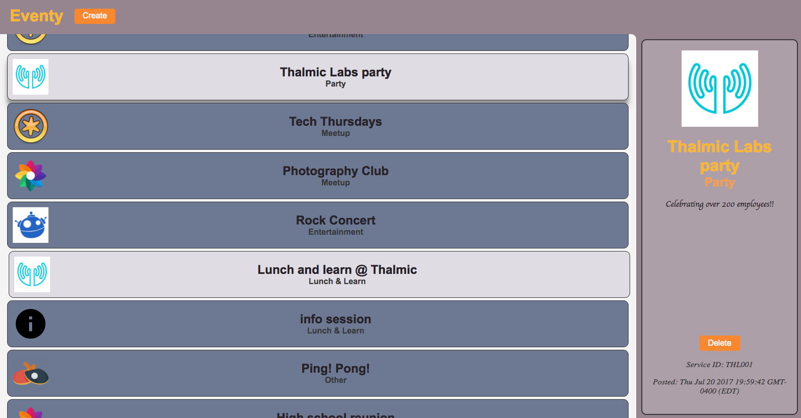
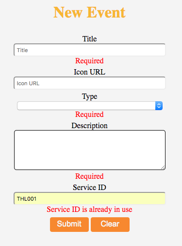
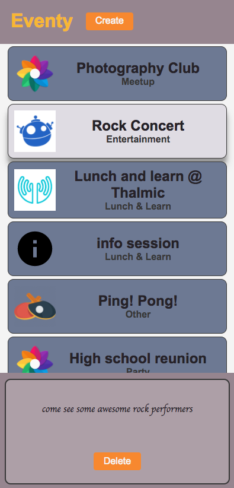

# Eventy

Event is a simple event App made in React for Thalmic Labs.

### [Live Demo](https://ffiargus.github.io/)

## Setup

Clone this Repo

Run NPM install

Run NPM start

Go to localhost:3000

## Features
The App includes form validations to check that fields are filled and service IDs are not in use. The icon field is optional and a default image will be used if none is provided.

Responsive design was also incorporated and the page will be reorganized when scaled to a small screen.

## Explanation

I used the backend heroku server that was provided to make fetch requests to get, post and delete events. I decided to use Redux, as it provides for accessible state management and allows the app to be more easily scaled if more features were to be added in the future.

Inside the styles folder, there is a file called tweakable.scss which can be used to easily modify things within the app such as colors and text fonts.

If there are any issues or something needs clarification, please let me know.

## Dependencies

* Webpack-dev-server
* Babel
* Node Sass
* React
* React-Modal
* Redux
* React-Redux
* Redux-Form